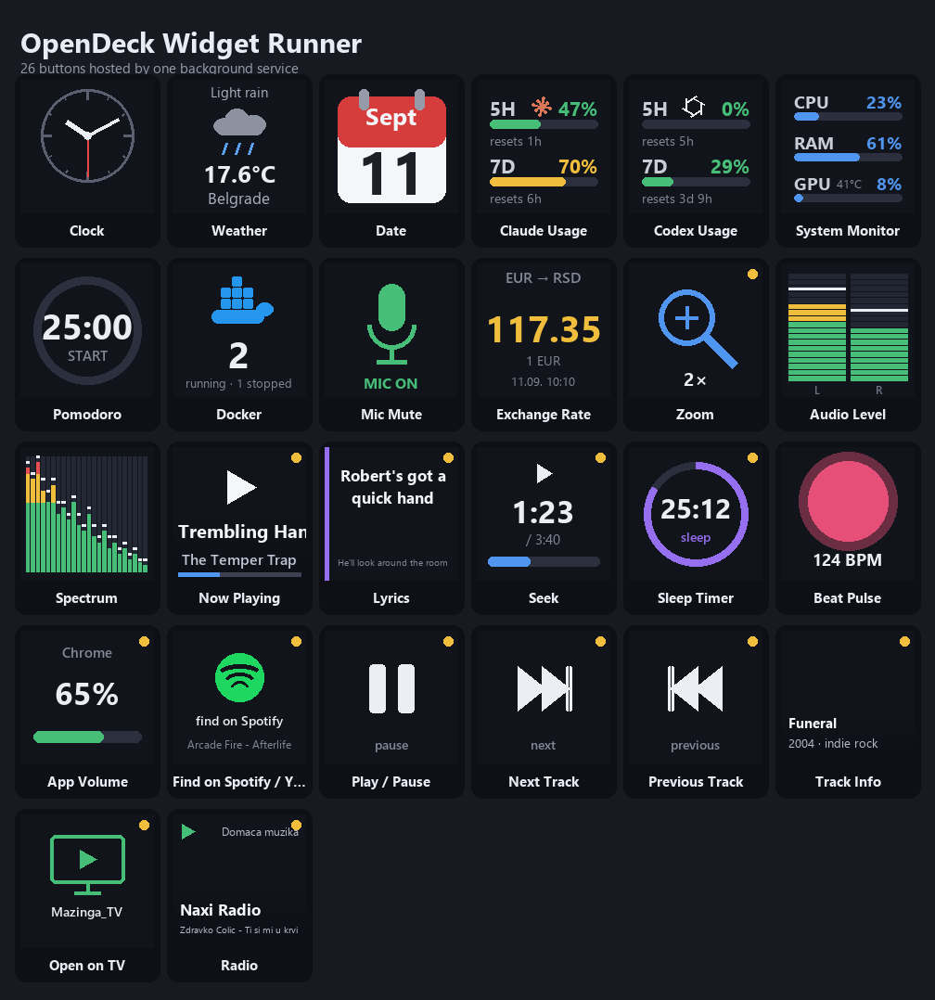

# OpenDeck Widget Runner

One Python background service that hosts **26 live widgets** for an
[OpenDeck](https://github.com/nekename/OpenDeck)-compatible macropad or Stream
Deck-style device. Instead of a separate process per button, a single
long-running plugin renders every icon, polls every data source, and reacts to
every key, dial, and touch event.

Built and tested on an **Ajazz AKP03E** (encoder + touch keys) on Windows, but
it speaks the standard Elgato Stream Deck plugin protocol that OpenDeck
implements, so it should work on any device OpenDeck supports.



> Buttons marked with a small dot in the corner are **encoder-aware** — turn the
> dial or tap the touch strip, not just press.

## Widgets

**Clock &amp; information**
- **Clock** — analog or digital face
- **Weather** — current conditions from [Open-Meteo](https://open-meteo.com/) (no API key)
- **Date** — today's date as a tear-off calendar page
- **Exchange Rate** — live currency rate (default EUR &rarr; RSD); press opens Google Finance

**Development &amp; system**
- **Claude Usage** — Claude Code 5-hour / 7-day usage limits
- **Codex Usage** — OpenAI Codex 5-hour / 7-day usage limits
- **System Monitor** — CPU / RAM / GPU load; press opens Task Manager
- **Docker** — running / stopped container counts; press opens Docker Desktop
- **Pomodoro** — focus/break timer; press start-pause, hold to reset
- **Zoom** — screen magnifier without the Magnifier window; key toggles, dial adjusts

**Audio**
- **Audio Level** — stereo output meter (L | R segments)
- **Spectrum** — real-time frequency spectrum of the output (WASAPI loopback + FFT)
- **Beat Pulse** — pulses on the beat of whatever is playing, shows BPM
- **Mic Mute** — default microphone state; press toggles
- **App Volume** — dial sets the volume of the app playing music; press mutes it

**Media &amp; now playing**
- **Now Playing** — current track from the browser / media app; press = play-pause, dial = previous
- **Play / Pause**, **Next Track**, **Previous Track** — media transport keys
- **Seek** — dial scrubs the current track; press = play-pause
- **Sleep Timer** — pauses playback after 15 / 30 / 60 min; dial adjusts
- **Lyrics** — synced lyrics from [LRCLIB](https://lrclib.net/) as a screen overlay
- **Track Info** — album / year / genre / cover from MusicBrainz + Cover Art Archive
- **Find on Spotify / YouTube** — search the current track on the other platform
- **Open on TV** — send the current YouTube video to an Android TV (adb / SmartTube)
- **Radio** — internet radio via [mpv](https://mpv.io/): a local `.m3u` playlist or
  [radio-browser](https://www.radio-browser.info/) search, with an on-screen menu,
  favorites, and a blacklist (short press play/stop, double-press favorite, long-press menu)

Every icon is drawn on the fly as a 144&times;144 PNG, so the display always reflects
live state — volume, track, timer countdown, weather, and so on.

## How it works

A single process (`runner.py`) connects to OpenDeck over the Stream Deck
WebSocket protocol and keeps a `Widget` instance per visible button. The base
class in `widgetlib.py` handles image packing, settings, and a small `every()`
scheduler; each file under `widgets/` implements one widget's drawing and event
handling.

Because it is one process, widgets can share expensive resources — a single
WASAPI loopback capture feeds the spectrum, level meter, and beat detector; one
mpv instance backs the radio; one SMTC session read serves every media widget.

Nothing here needs an API key. External data comes from free, keyless services
(Open-Meteo, open.er-api.com, radio-browser, LRCLIB, MusicBrainz).

## Requirements

- **Windows 10 or 11**
- **[OpenDeck](https://github.com/nekename/OpenDeck)** with a supported device
- **Python 3.11+**
- Python packages:

  ```
  pip install websockets pillow numpy certifi winsdk
  ```

Optional, only for the widgets that use them:
- **[mpv](https://mpv.io/)** — Radio
- **adb** (Android platform-tools) — Open on TV
- **Docker Desktop** — Docker widget

## Install

1. Clone this repository, then link (or copy) the plugin folder into OpenDeck's
   plugin directory. A junction keeps it in place and easy to update:

   ```bat
   git clone https://github.com/avionbg/opendeck-widget-runner.git
   mklink /J "%APPDATA%\com.elgato.StreamDeck\Plugins\com.goran.widgetrunner.sdPlugin" "C:\path\to\opendeck-widget-runner\com.goran.widgetrunner.sdPlugin"
   ```

   (OpenDeck reads Stream Deck plugins from the same location. Check your
   OpenDeck build for the exact plugins path if it differs.)

2. The plugin launches through `run.cmd`, which points at a Python
   interpreter. Edit it to match your install if needed:

   ```bat
   "C:\Python3\pythonw.exe" "%~dp0runner.py" %*
   ```

3. Restart OpenDeck and drag any Widget Runner action onto a key.

## Configuration

Machine-specific paths live in **`config.py`** with safe generic defaults. Do
not edit it. Instead copy `userconfig.example.py` to **`userconfig.py`** and set
only what you need — it is git-ignored, so your personal paths never reach the
repository:

```python
# userconfig.py
MPV_PATH  = r"C:\path\to\mpv.exe"     # portable mpv builds are not on PATH
M3U_PATH  = r"C:\path\to\stations.m3u"
M3U_GROUP = "My stations"             # "" = all groups in the .m3u
TV_IP     = "192.168.1.50"            # Android TV, adb debugging enabled
MUSICBRAINZ_CONTACT = "you@example.com"
```

Anything left unset keeps the generic default. Every value can also be
overridden per button from its property inspector, which is the easiest way to
configure a single key.

## License

MIT — see [LICENSE](LICENSE).
